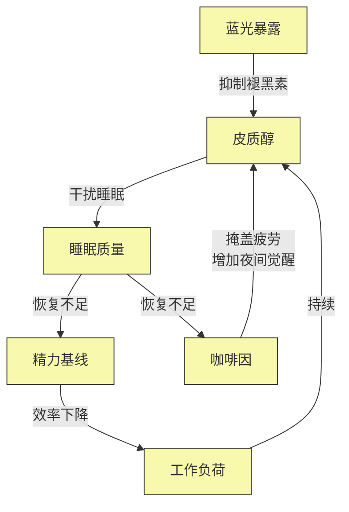
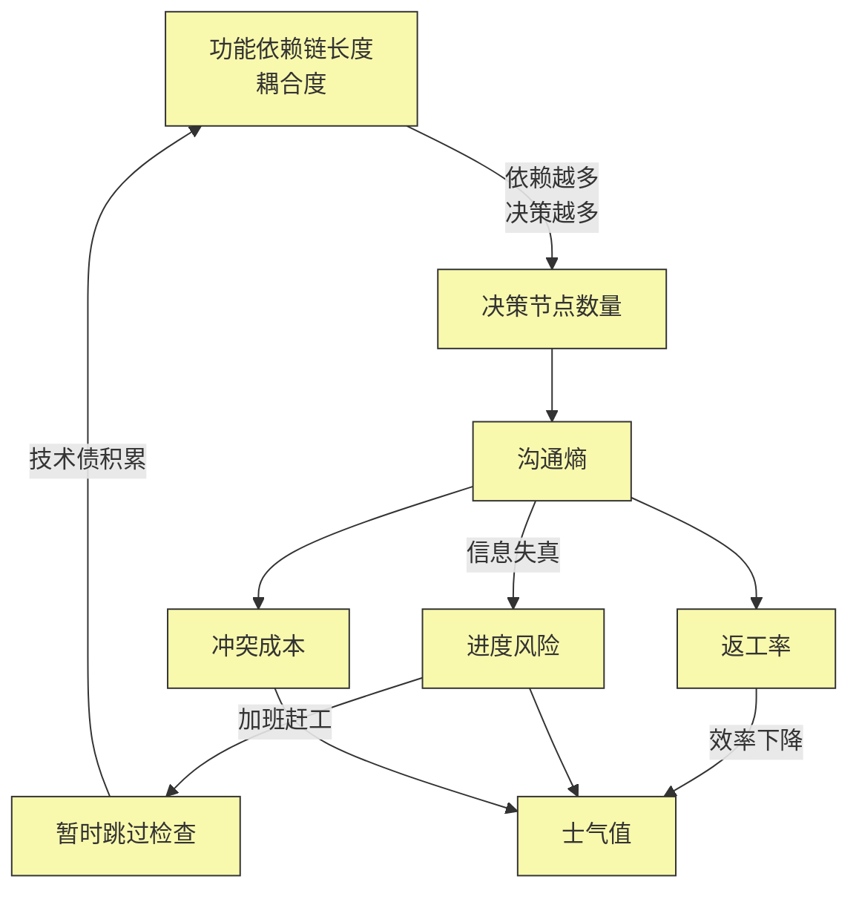
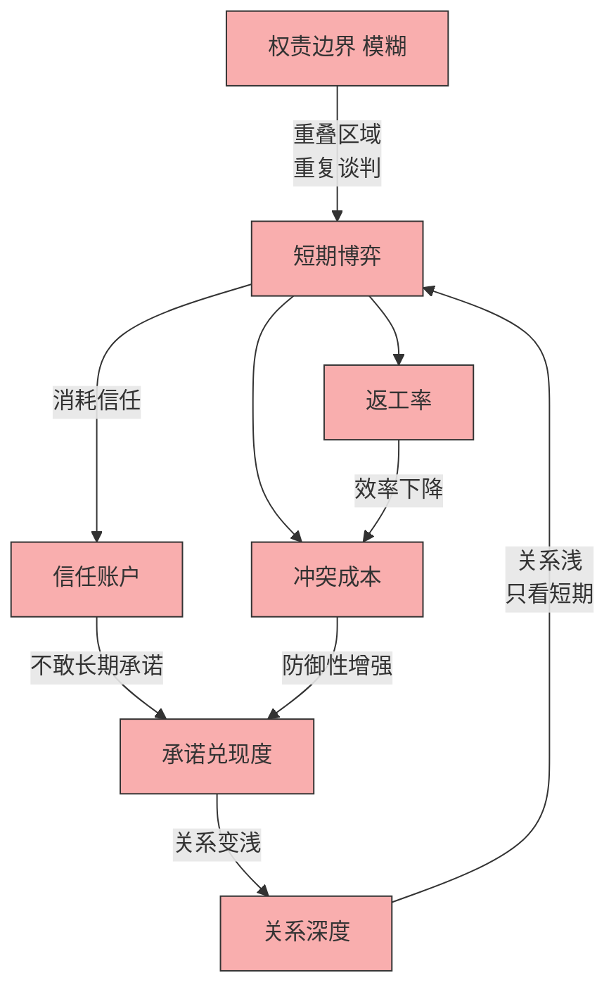
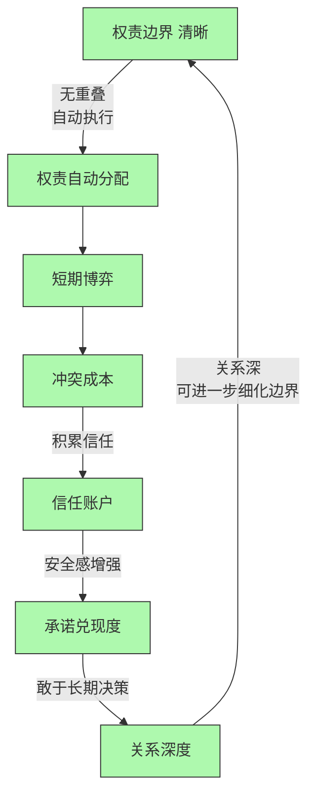

> "我们往往试图用战术上的勤奋，掩盖战略上的懒惰。"——雷军

<!-- mermaid support -->
<script src="https://cdn.jsdelivr.net/npm/mermaid@10/dist/mermaid.min.js"></script>

<!-- more -->

## 开篇：被"补窟窿"困住的一天

早上 7 点，闹钟响了。你感觉和昨天一样累。周末明明补了 12 个小时的觉，为什么还是没有精神？上班路上，你喝了第三杯咖啡——这是你对抗疲惫的"战术性武器"。

到了公司，项目进度又延期了。又是那个问题：代码返工率高。团队决定：本周全员加班赶工。你记得上个月就是这样，再上个月也是。每一次，我们都觉得"这次不一样，这次能追回来"。

晚上 10 点回家，伴侣问你："今天谁洗碗？"你心里一紧——这句话是你最不愿意听到的开场白。每次这个问题都会引发一场争论。你们讨论过多次"如何更好地沟通"，甚至一起学了"非暴力沟通"。但为什么这次还是不可避免地争吵了？

这是一个被"补窟窿"思维困住的一天：

- 疲惫了 → 补觉
- 进度慢 → 加班
- 发生冲突 → 学沟通技巧

我们在不停地修补症状，但系统却越来越糟糕。为什么会这样？

**因为问题的根源不是"不够努力"或"方法不对"，而是"结构错了"。**

---

## 第 1 节：3 分钟理解结构第一性原理

### 1.1 核心概念：结构 vs 功能

在软件架构中，有一个区别被广泛接受：

- **结构（Structure）**：系统的组织骨架、规则、基本单元
- **功能（Function）**：系统的表现、产出、具体行为

这个概念同样适用于生活、工作和人际关系。

**结构第一性原理**的核心主张是：**系统的功能表现（好或坏）是由其底层结构决定的**。如果你想改变系统的功能（比如"不累"、"不延期"），你必须先改变它的结构。

### 1.2 两种思维方式

**类比思维**（绝大多数人的默认模式）：
- "别人是怎么解决的？"
- "我以前是怎么做的？"
- "行业最佳实践是什么？"

**第一性原理思维**（结构化思维）：
- 这个系统的**结构**是什么？
- 要素的**连接方式**是什么？
- 如果不改变结构，同样的问题会**必然**发生吗？

### 1.3 简单判准：你的诊断对了吗？

在深入案例之前，先用这个测试表快速判断：

**工具 1：三道关卡测试表**

```
你的诊断通过了吗？

□ 不可再分性
  - 你得出的原因还能继续追问"为什么"吗？
  - 如果能，说明你停在症状层，还没到结构层。

□ 必然性
  - 如果换一个人在这个位置，会发生同样的事吗？
  - 如果答案是"是"，说明你抓住了结构（结构决定行为）。

□ 简洁性
  - 改变结构后，问题能自动消失吗？
  - 还是需要持续的努力来维持"修复"？
```

如果这三个问题你都能肯定回答，恭喜你——你已经用结构第一性原理在思考了。

---

## 第 2 节：诊断框架——正向案例 vs 反向案例

### 2.1 反向案例：经验/类比分析

**特征**：
- 诊断基于经验："以前这样做有效"
- 关注焦点：症状（不舒服的地方）
- 行动方案：修补（打补丁）
- 长期后果：系统债、路径依赖、复杂度增加

**典型思维**：
- "我需要更多自律"
- "学习更好的沟通技巧"
- "加班就能赶进度"

### 2.2 正向案例：结构/第一性分析

**特征**：
- 诊断基于第一性原理：拆解到不可再分的要素
- 关注焦点：结构（要素 + 连接 + 回路）
- 行动方案：重构（调整底层规则）
- 长期后果：系统红利、简洁性、自动化解决

**典型思维**：
- "这个强化回路是如何自我维持的？"
- "哪个连接导致了这个必然结果？"
- "调整结构后，问题能自动消失吗？"

### 2.3 对比表

| 维度 | 反向案例 | 正向案例 |
|------|---------|---------|
| **诊断逻辑** | 经验类比 | 第一性推理 |
| **关注焦点** | 症状 | 结构 |
| **行动方案** | 修补 | 重构 |
| **认知负荷** | 低（模仿就行） | 高（需要拆解） |
| **长期效果** | 问题反复出现 | 问题彻底消失 |
| **系统复杂度** | 越补越复杂 | 越改越简洁 |

---

## 第 3 节：三大实战场景

接下来，我们通过三个典型场景，看看如何从"修补者"转变为"结构设计师"。每个场景都配有实操工具，你可以边读边试。

---

### 场景 1：生活——为什么周末补觉永远不够？

#### 问题引入

你感觉到一种长期的疲惫：
- 周一早上醒来和周五晚上一样累
- 咖啡从一杯变成三杯，但效果递减
- 周末睡 12 小时，下周三又崩溃了
- 你怀疑是自己"老了""体质差"

这不是年龄问题，这是**结构问题**。

#### 工具 2：SFP 绘图四步协议

别急着看答案，先试着自己画图。拿出一张白纸，按照这四步来：

```
步骤 1：定义边界与要素分解
- 列出系统内的所有要素（必须是名词）
- 检查：要素必须足够独立，不能包含动词
- 范例：睡眠质量、皮质醇、蓝光暴露、工作负荷、咖啡因

步骤 2：建立连接与标注关系
- 问自己："A 是否直接影响 B？"
- 如果是，画一条有向箭头（必须带箭头！A→B 和 B→A 截然不同）
- 在箭头上标注关系动词：抑制、消耗、激活、依赖
- 禁止模糊连接：不要画"相关"，要写"如何相关"

步骤 3：识别反馈循环
- 退后一步看：有没有闭环？
- 箭头方向：R 是强化循环（恶性/良性），B 是平衡循环（稳态）
- 数一下：0 个闭环？可能画错了（现实系统几乎总有回路）

步骤 4：编写结构化叙事
- 用 3-5 句话写下这幅图讲的故事
- 关键：要能回答"为什么会反复发生这个问题？"
```

#### 系统结构图

这是你画完图后，应该看到的样子：



**ASCII 版本（备用查看）：**

```
                        蓝光暴露 (输入)
                             │
                             │ (抑制褪黑素)
                             ▼
                        皮质醇 ↑
                     ／           │
       (持续)       ／            │ (干扰睡眠)
                   ／             ▼
         工作负荷 ──────►  睡眠质量 ↓
                   ▲             │
                   │             │ (恢复不足)
                   │             ▼
                咖啡因 ↑ ◄──── 精力基线 ↓
                   │
                   │ (掩盖疲劳，但增加夜间觉醒)
                   └─────────────────┘
                    (强化循环 R1)
```

#### 回路识别：R1——疲劳恶性循环

这是一个经典的**自毁强化循环**：

```
工作负荷 ↑ → 咖啡因 ↑ → 蓝光暴露 ↑ → 皮质醇 ↑
                                    ↓
                              睡眠质量 ↓
                                    ↓
                              精力基线 ↓
                                    ↓
                              工作效率 ↓
                                    ↓
                              工作负荷 ↑ （回到起点）
```

**系统的核心矛盾**：你试图用"工作后的刺激手段（咖啡、蓝光）"来应对"工作带来的消耗"，但这些刺激手段恰恰破坏了"恢复机制（睡眠）"。

#### 工具 3：结构化叙事模板

填空就能写出你的分析：

```
这张图揭示了：系统的核心矛盾在于 ______。

______ 破坏了 ______ 机制。

系统是一个 ______ 时间延迟的负反馈系统。

（示例）
这张图揭示了：系统的核心矛盾在于 咖啡因和蓝光掩盖了疲劳，但破坏了睡眠修复机制。

短期刺激破坏了长期恢复机制。

系统是一个 3-7 天时间延迟的负反馈系统。
```

#### 改进方案对比

| 反向修补法（功能级）| 正向重构法（结构级）|
|---------------------|---------------------|
| 周末睡懒觉补觉（无效）| 建立"光照-睡眠"约束：晚上 9 点后强制开启夜间模式 |
| 喝更多咖啡提神（恶性循环）| 重构能量补偿机制：用 20 分钟高强度间歇运动替代咖啡 |
| 学时间管理技巧（治标不治本）| 设定工作边界：晚上 7 点后关闭工作负荷输入阀 |

#### 立即行动：你的第一个结构图

拿出纸笔，用 5 分钟画一个你当前面临的生活问题。不要追求完美，画出来就行——**这是从修补者到结构设计师的第一步。**

---

### 场景 2：工作——为什么加班赶工只会让项目更慢？

#### 问题引入

项目又延期了。团队的例行反应：

1. 本周全员加班（延长工作时间）
2. 增加进度汇报会（更多监督）
3. 写更详细的周报（更多文书）

下个月呢？**又延期了**。

这已经是第 10 次循环。为什么"加倍的勤奋"没有带来加倍的结果？

#### 工具 4：快速画图技巧

如果你时间有限，不要试图画出整个系统。用这个简化方法：

```
快速画图技巧：
1. 找到系统的"痛点节点"（如：返工率、进度风险）
2. 沿着"什么导致它？"画上游（向左/向下的箭头）
3. 沿着"它导致了什么？"画下游（向右/向上的箭头）
4. 最少要画出一个闭环——闭环才是系统！
```

#### 系统结构图

项目系统的核心结构：



**ASCII 版本（备用查看）：**

```
    功能依赖链长度（耦合度）
           │
           │ (依赖越多，决策越多)
           ▼
      决策节点数量
           │
           ▼
      沟通熵 ↑ ◄──── 冲突成本 ↑ ◄──── 返工率 ↑
           │                              ▲
           │ (信息失真)                   │ (效率下降)
           ▼                              │
      进度风险 ───────────► 士气值 ↓ ──────┘
           │
           │ (加班赶工)
           ▼
     暂时跳过检查 (单元测试)
           │
           │ (技术债积累)
           ▼
    功能依赖链长度 ↑ ────┘
           ▲
           │
           └──── (强化循环 R1)
```

#### 回路识别：R1——延期陷阱

这是一个**技术债强化循环**：

```
进度风险 → 加班赶工 → 跳过检查 → 技术债 → 依赖链更长 → 沟通熵更高
    ▲                                                        │
    └────────────────────────────────────────────────────────┘
```

**系统的本质问题**：不是人的效率低，而是**耦合结构问题**。

决策节点的增殖源于功能模块是"链式依赖"——一个模块动，所有相关模块都要动。沟通熵源于信息的单向传递链（A→B→C），而非多向同步广播。

#### 工具 5：结构金句生成器

画完图后，写下一句金句。这是你结构化思考的成果：

```
系统画的不是"谁错了"，而是"什么结构导致了这个必然结果"。

你的金句是：
"______ 不是 ______ 问题，而是 ______ 的结构问题。"

（示例）
项目延期不是执行力差问题，而是耦合度高的结构问题。
疲惫不是意志力问题，而是能量输入-输出失衡的结构问题。
争吵不是沟通技巧问题，而是权责边界模糊的结构问题。
```

把这个金句写在便利贴上，贴在显眼处。它会提醒你：**先思考结构，再行动。**

#### 改进方案对比

| 反向修补法（功能级）| 正向重构法（结构级）|
|---------------------|---------------------|
| 加班赶工 | 解耦架构：将大团队拆分为 3-5 人自治小组，每个小组独立交付 |
| 增加进度会 | 广播式同步：设立每日 15 分钟站会，信息直接传播到所有人 |
| 惩罚返工 | 重构依赖方向：使用事件驱动架构，从链式依赖改为事件广播 |

#### 立即行动

想想你现在面临的一个工作难题：
1. 用"快速画图技巧"，画出它的核心结构
2. 用"结构金句生成器"，写下一句金句
3. 问自己：**这个结构的哪个连接导致了必然结果？**

---

### 场景 3：人际——为什么"沟通技巧"解决不了争吵？

#### 问题引入

你与伴侣的循环争吵：

1. 发生冲突 → 争论"谁应该做这件事"
2. 和好 → 讨论如何更好地沟通
3. 下次冲突 → 又回到步骤 1

你们一起学过"非暴力沟通"，讨论过"彼此要体贴"，甚至写过关系保证书。

但**问题从未解决过**。

#### 工具 6：双人关系绘制特别指南

绘制人际关系系统时，有特别要注意的点：

```
绘制要点：
1. 用不同颜色区分两个人的要素（A 的要素用蓝色，B 的用红色）
2. 关注"边界重叠区"——往往是冲突源（如"谁做家务"的区域）
3. 识别信任账户（类似于银行账户）：
   - 存钱：信守承诺、不消耗信任的行动
   - 取钱：争吵、违约、消耗信任的行动
4. 区分短期博弈（一次谈判）vs 长期博弈（建设关系）
   - 短期：谁能说服谁？
   - 长期：如何让系统自动运行？
```

#### 系统结构图（双循环）

人际关系的系统有两种状态，取决于"边界是否清晰"：

**状态 1：边界模糊 → 信任崩溃循环（R1）**



**ASCII 版本（备用查看）：**

```
    权责边界 (模糊)
           │
           │ (重叠区域 → 重复谈判)
           ▼
      短期博弈 ↑ ◄──── 冲突成本 ↑ ◄──── 返工率 ↑
           │                              ▲
           │ (消耗信任)                   │ (防御性增强)
           ▼                              │
      信任账户 ↓ ────────────► 承诺兑现度 ↓
           │                              │
           │ (不敢长期承诺)               │ (关系变浅)
           ▼                              │
      关系深度 ↓ ─────────────────────────┘
           │
           │ (关系浅 → 只看短期)
           ▲
           │
           └──── (强化循环 R1)
```

**状态 2：边界清晰 → 信任建设循环（B1）**



**ASCII 版本（备用查看）：**

```
    权责边界 (清晰)
           │
           │ (无重叠 → 自动执行)
           ▼
      权责自动分配
           │
           ▼
      短期博弈 ↓
           │
           ▼
      冲突成本 ↓
           │
           │ (积累信任)
           ▼
      信任账户 ↑ ────────────► 承诺兑现度 ↑
           │                              │
           │ (安全感增强)                 │ (敢于长期决策)
           ▼                              │
      关系深度 ↑ ─────────────────────────┘
           │
           │ (关系深 → 可进一步细化边界)
           │
           └──── (平衡循环 B1)
```

#### 回路识别

- **R1（崩溃循环）**：边界模糊 → 短期博弈 → 消耗信任 → 关系变浅 → 更依赖短期博弈
- **B1（建设循环）**：边界清晰 → 自动执行 → 积累信任 → 关系加深 → 可进一步细化边界

**系统的本质问题**：人际关系的本质是**信任资本在时间上的复利**。

当权责边界模糊时，每次互动都是一次"重新谈判"的零和博弈，系统被迫停留在短期博弈状态。信任账户的底层规则是：**每一次不消耗信任的交互，都在增加信任**；而每一次"谁来做这件事"的争论，都在提取信任账户。

系统要切换到长期模式，必须消除"重复博弈"的必要——即通过产权/边界划分，将互动从谈判转为自动执行。

#### 工具 7：关系结构健康检查单

用这个单子，快速诊断你当前的关系系统：

```
□ 权责边界是否清晰？
  - 有没有"重叠责任区"？（例如：厨房、账单、孩子教育）
  - 每个人是否有"绝对责任区"？（例如：我负责厨房，你负责客厅）

□ 信任账户是否有正向积累？
  - 最近 30 天，存钱事件（信守承诺）多，还是取钱事件（争吵）多？

□ 短期博弈是否减少？
  - 每周需要"重新谈判"的次数？
  - 有些事情是不是可以"自动执行"？

□ 是否有"硬编码规则"？
  - 不需要"彼此体贴"的软约束
  - 而是"周三是约会日""账单日是每月 1 号"的硬规则
```

#### 改进方案对比

| 反向修补法（功能级）| 正向重构法（结构级）|
|---------------------|---------------------|
| 学习非暴力沟通技巧（结构不变）| 绝对责任区划分：明确"厨房归我，客厅归你"|
| 要求对方多道歉（临时缓解）| 建立"承诺-兑现"记录：用表格记录承诺完成情况|
| 写关系保证书（无约束力）| 从"协议"转向"规则"：不约定彼此要体贴，而是约定周三约会日|

#### 立即行动

想想你最近的一段冲突：
1. 用"双人关系绘制特别指南"，画出当前的关系循环
2. 用"关系结构健康检查单"，诊断问题出在哪个环节
3. 问自己：**有没有一个"自动执行"的规则能消除这次谈判？**

---

## 第 4 节：实操工具箱——确保每次都画对

你现在已经学会了如何画图，但如何确保画对？本节提供系统的验证方法。

### 工具 8：系统结构图验证清单

画完图后，逐一检查：

#### 结构有效性测试

```
□ 极端条件测试
  - 如果要素 A 消失，系统会崩溃吗？
  - 如果箭头强度无限大，系统会怎样？
  - 如果模型的推演结果是荒谬的，说明结构错了。

□ 维度一致性
  - 确保同层次要素的逻辑粒度一致
  - 不要把"国家"和"某个员工"画在同一层
```

#### 行为预测力测试

```
□ 能解释复发性现象吗？
  - 如果问题反复发生，你的模型能解释"为什么"吗？

□ 能揭示"修补法为什么无效"吗？
  - 你是否看到了"修补法"是如何进入系统、反而加固了问题循环？

□ 有反直觉洞察吗？
  - 好的 SFP 模型通常能揭示"常识性修补法"为什么无效
```

#### 简洁性优势测试

```
□ 比修补法更简洁吗？
  - 改变结构后，问题能自动消失吗？
  - 还是需要持续的努力来维持"修复"？
```

### 工具 9：可重复的 SOP

为了确保每次画图的**一致性，建立这个标准操作流程**：

#### 阶段 I：约束前置（绘图前）

```
1. 强制画板原则
   - 每次分析必须先用物理实体工具（白板、纸笔）
   - 不要直接用软件——物理画板能防止你在屏幕上对细节纠结
   - 从而忽视整体结构

2. 五问停止原则
   - 在确定"根本原因"之前，强制进行五次追问
   - 如果不到五次就停止，你很可能停在了症状层
```

#### 阶段 II：图化验证（绘图中）

```
3. 名词动词检查法
   - 画完图后，检查所有节点
   - 如果是名词短语（如"沟通不畅"），重写为独立名词（"沟通"）
   - 检查所有连线：如果是模糊描述（如"有关系"），重写为动词（"阻塞"）

4. 回路计数法
   - 数一下图中有多少个闭环
   - 0 个闭环？大概率图错了（现实系统几乎总是有回路）
   - 超过五个闭环？可能复杂度过高，尝试合并或聚焦
   - 理想范围：1-3 个核心回路
```

#### 阶段 III：外部验证（绘图后）

```
5. 红黑帽检查
   - 黑帽（魔鬼代言人）："如果我是反对这个模型的人，我会攻击哪里？"
   - 红帽（利益相关者）："如果这事发生在我身上，这张图能解释我的感受吗？"

6. 回溯预测法
   - 回到历史数据，问自己：
   - "如果我在三年前就看到这张图，我能预测到今天这个问题吗？"
   - 如果答案是肯定的，模型通过了时间验证
```

---

## 第 5 节：从一个修补者到结构设计师

### 核心理念回顾

结构第一性原理的精髓可以用一句话总结：

> **你无法在错误的结构上得到正确的结果。**

修补法试图改变"输入"或"参数"，而结构原理法改变的是"连接"和"规则"。

- 补觉是改变参数，**光照-睡眠约束**是改变规则
- 加班是改变参数，**解耦自治**是改变规则
- 学技巧是改变参数，**边界划分**是改变规则

### 行动建议：从下一个问题开始

从今天开始，当你遇到任何问题时，试试这个流程：

```
1. 暂停行动
   - 不要急着"解决问题"，先停下来

2. 画出系统的结构图
   - 用 SFP 绘图四步协议
   - 用快速画图技巧（如果时间紧迫）

3. 识别核心回路
   - 这是强化循环吗？（越补越糟）
   - 还是平衡循环？（自我修正）

4. 问自己
   - 这个结构的哪个连接导致了必然结果？
   - 改变哪个结构，问题就能自动消失？

5. 写下一句结构金句
   - 把它贴在显眼处
   - 下次遇到同类问题，一眼就看到方向
```

### 一个修补者的典型一天 vs 一个结构设计师的一天

**修补者的一天：**
- 醒来 → 喝咖啡 → 加班补进度 → 晚上为家务争吵 → 周末补觉

**结构设计师的一天：**
- 昨晚画出了精力系统的图 → 晚上 9 点关闭蓝光 → 早上精力充沛 → 团队解耦，无需加班 → 边界清晰，无需争吵 → 周末真正休息

### 最后一句金句

> **修补者总是问"我该怎么做？结构设计师总是问"这个系统该如何运作？****

从修补者到结构设计师，这不是一个容易的转变。它需要：
- 忍住"立即行动"的冲动
- 花时间画图，而不是"解决问题"
- 承认"我的直觉可能是错的"

但一旦你开始了，你会发现：
- 问题的根因变得更加清晰
- 你的行动变得更加精准
- 你的系统变得越来越自动化

**结构设计是一门艺术，但它是一门可以通过练习掌握的艺术。**

从下一个问题开始，先画图，再行动。

---

## 附录：延伸阅读

如果你想进一步深入系统思维和结构设计，推荐以下资源：

**经典书籍：**
- 《Thinking in Systems》（《系统之美》）—— Donella Meadows
- 《The Fifth Discipline》（《第五项修炼》）—— Peter Senge
- 《Principles》（《原则》）—— Ray Dalio

**方法论：**
- Causal Loop Diagrams（因果循环图）
- Stock and Flow Diagrams（存量流量图）
- Wardley Mapping（价值链演化图）

**思维工具：**
- Minto 金字塔原理（逻辑结构化）
- 第一性原理（Elon Musk, Naval Ravikant）
- 反馈回路识别（强化循环 vs 平衡循环）

---

*如果你在实践中有任何问题或发现有趣的系统结构，欢迎在评论区分享。结构设计是一门值得共同探索的艺术。*

**作者笔记**：本文基于真实案例和系统思维理论撰写。如果你发现某个场景"这不就是我吗？"——很好，这意味着你已经意识到了结构问题的存在。这是第一步。
